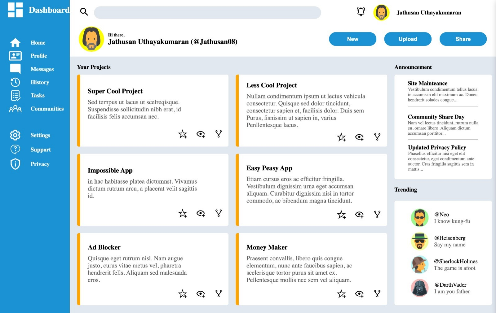

# Admin_Dashboard

Intermediate-Odin project

## Introduction

Welcome to the Admin Dashboard project, part of the Intermediate HTML and CSS Course From Odin. In this project, I have will built a comprehensive dashboard design, leveraging the power of Grid for efficient layout creation.

Admin Dashboard project created with HTML and CSS.

## Getting Started

To get started with the game in your web browser, follow these instructions:

## Prerequisites

You need a modern web browser that supports HTML and CSS.

## Installation

Clone this repository to your local machine or download the ZIP file and extract it to a local folder. Open the index.html file in your web browser.
